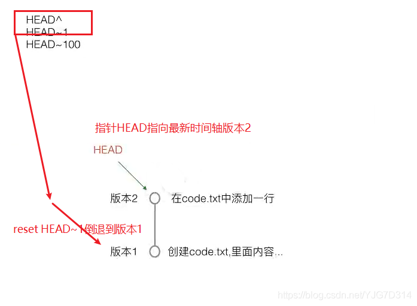

## git学习指北

- - -
### git概念图


Workspace：工作区

Index / Stage：暂存区

Repository：仓库区（或本地仓库）

Remote：远程仓库

- - -
### 如何使用git？
- - - 
#### 基本流程：
情景1：先在本地建立本地库，后有远程库，然后关联远程库

0. 如果是第一次使用，需要先设置用户名和邮箱
   ```
   # 设置用户名样例
   git config --global user.name "zhangshan"

   # 设置用户邮箱样例---跟GitHub关联的邮箱是一样的。
   git config --global user.email zhangsan.me@qq.com 

   # 查看用户名
   git config user.name

   # 查看邮箱
   git config user.email

   ```
1. 在本地创建一个项目目录并进入（可以手动创建也可以使用命令）
   `mkdir git_tests && cd git_tests`
2. 初始化git仓库
   `git init`
3. 在项目目录下进行开发，如新建一个README.md文件并写入hello：
   `echo "hello" >> README.md`
4. 提交文件
   `git add README.md`提交单个文件或者`git add .`提交所有文件
5. 创建commit提交信息
   `git commit -m "备注"`
6. 在本地代码推送到远端之前，需要先设置远程仓库的地址`git remote add origin url`,其中的url为从github对应项目的https链接或者ssh链接。origin只是仓库名，也可以改成origin01，也可以改成xxx，一般远端仓库的默认名字是写origin的。
7. 如果要使用ssh地址，需要将本地公钥复制到github的SSH keys上，详细步骤略过。
8. 往远端仓库提交代码
   `git push -u origin main`

这样一个最基本的推送代码到自己github上的操作就完成了！

情景2：先有远程库，想建立本地库进行关联

0. `git clone url`: 克隆远程库到本地
1. 不需要进行`git init`，直接进行开发即可
2. `git add .`
3. `git commit -m "备注"`
4. ...

接下来介绍其他的常用指令。
- - -
#### 版本创建与回退
- `mkdir git_test` : 创建一个目录
- `ls` : 显示当前目录下不被隐藏的文件和文件夹
- `ls -a` : 显示当前目录下的所有文件及文件夹，其中包括所有被隐藏的文件和文件夹
- `ls -l` : 显示不被隐藏的所有文件与文件夹的详细信息，并成列表显示
- `ls -al` : 显示的所有文件与文件夹的详细信息，包括所有被隐藏的文件和文件夹，并成列表显示
- `git init` : 初始化仓库
- `touch filename` : 在当前目录下创建一个文件，如touch code.txt
- `vi code.txt` : 编辑文本
- `cat code.txt` : 查看内容
- `git add .` 或 `git add filename` : 将工作区文件提交到暂存区
- `git commit -m "备注"` : 将暂存区文件提交到本地仓库
- `git log` : 查看版本记录
- `git log --pretty=oneline` : 精简的版本记录
- `git reset --hard HEAD^` : 将暂存区和工作区都回退到某个版本，其中`HEAD`为指针，指向当前的最新版本，加了一个`^`表示当前版本的前一个版本，`^^`表示前前版本，也可以用`HEAD~1`表示前一个版本，`HEAD~100`表示前100个版本，以此类推。

- `git reset --hard 版本号` : 回到刚才的版本，版本号为刚才的最新版本
- 如果退出终端重进看不到回退操作前的版本号，使用`git reflog`来查看操作记录，再将版本号复制并使用`git reset --hard` 版本号
`git status` 查看当前工作树的状态，可以看到当前的分支名，`modified`的文件或者`untracked`的文件，然后把他们add到暂存区。
- 执行`git commit -m "备注"`命令一次性把暂存区的所有修改提交到分支并创建一个版本，HEAD指针永远指向当前版本。
- `git checkout -- filename` 撤销工作区的修改，回到和版本库一模一样的状态
- `git reset HEAD filename`  将暂存区的修改撤销，重新放回工作区
- `git diff HEAD -- filename` 对比工作区和HEAD版本中某个文件的不同
- `git diff HEAD HEAD^ -- filename` 对比HEAD和HEAD^版本中的某个文件的不同
- `rm filename` 删除当前目录的某个文件
- `git checkout -- filename` 恢复那个被rm的文件
- `git nm filename` 删除当前目录的某个文件
- `git reset HEAD filename` 恢复被`git rm`的文件，然后在使用`git checkout -- filename`恢复

- - -
#### 分支管理

- `git branch` : 查看当前哪有几个分支且在哪个分支下工作
- `git checkout -b dev` : 创建一个新分支`dev` 并在上面工作
- `git checkout main` : 切换回主分支
- `git merge dev` : 将`dev`分支上的工作合并到`main`分支上，快速合并模式
- `git branch -d dev` : 删除`dev`分支
- 分支冲突的部分等到用到了再写吧
- `git branch --set-upstream-to=origin/远程分支名 本地分支名`, 如`git branch --set-upstream-to=origin/main main`
- `git pull origin 分支名称`: 将远程分支main上的代码下载并合并到本地所在分支

- - -
其他常用
- `git config --global -l` : 查看全局配置，如username、Email、代理等
- `git config --global --unset http.proxy`和`git config --global --unset https.proxy`取消代理
- `git config --global http.proxy http://127.0.0.1:7890` 
`git config --global https.proxy http://127.0.0.1:7890`
设置代理（git clone 失败时尝试关闭和打开代理）
